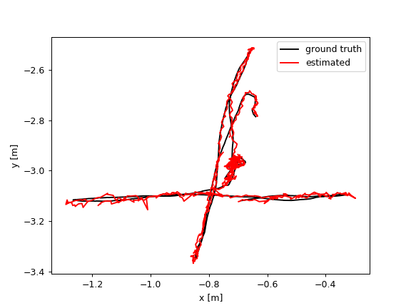
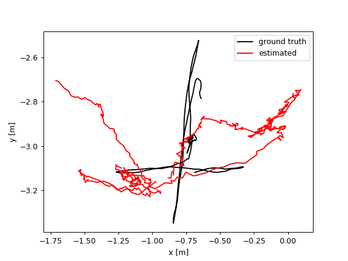

# Dynamic-ORB-SLAM2
**Author:** [Horace He](https://github.com/Horacehxw)

To cite this repo, please use [Pair-Navi: Peer-to-Peer Indoor Navigation with Mobile Visual SLAM](doi://10.1109/INFOCOM.2019.8737640)

Dynamic-ORB-SLAM2 is a robust visual SLAM library that can **identify and deal with dynamic objects** for monocular, stereo and RGB-D configurations. More specificly, the Mask R-CNN is applied to extract dynamic objects from input frame. Then a mask is applied to feature extractor to remove dynamic keypoints in each level of image pyramid.

The system shows superior result in  in camera trajectory estimation of TUM walking_xyz dataset compared to origin ORB-SLAM2. The absolute trajectory area goes down from 0.64 to 0.0016.

| Dynamic ORB SLAM2 | ORB SLAM2
:----:|:-------:
 | 

Examples are provided for TUM dataset in as both RGB-D and monocular. It's easy to do dynamic object exclusion in other ORB-SLAM2 examples by passing the model path in System class constructor.

# 1. License

Dynamic-ORB-SLAM2 is built upon ORB-SLAM2 and under the smae license accordingly.

ORB-SLAM2 is released under a [GPLv3 license](https://github.com/raulmur/ORB_SLAM2/blob/master/License-gpl.txt). For a list of all code/library dependencies (and associated licenses), please see [Dependencies.md](https://github.com/raulmur/ORB_SLAM2/blob/master/Dependencies.md).


# 2. Prerequisites
The library is tested only in Ubuntu 18.04 and OpenCV 3.4.5. OpenCV dnn module is required for dnn inference.

## C++11 or C++0x Compiler
We use the new thread and chrono functionalities of C++11.

## Pangolin
We use [Pangolin](https://github.com/stevenlovegrove/Pangolin) for visualization and user interface. Dowload and install instructions can be found at: https://github.com/stevenlovegrove/Pangolin.

## OpenCV
We use [OpenCV](http://opencv.org) to manipulate images and features, and to apply CNN model inference. Dowload and install instructions can be found at: http://opencv.org. **Required at leat 3.4.5 with dnn module support**.

Recommend install OpenCV from source with OpenCL turned on. This can dramatically speed up CNN inference with OpenCL GPU support.

## Eigen3
Required by g2o (see below). Download and install instructions can be found at: http://eigen.tuxfamily.org. **Required at least 3.1.0**.

## DBoW2 and g2o (Included in Thirdparty folder)
We use modified versions of the [DBoW2](https://github.com/dorian3d/DBoW2) library to perform place recognition and [g2o](https://github.com/RainerKuemmerle/g2o) library to perform non-linear optimizations. Both modified libraries (which are BSD) are included in the *Thirdparty* folder.


# 3. Building Dynamic-ORB-SLAM2 library and examples

Clone the repository:
```
git clone https://github.com/Horacehxw/Dynamic_ORB_SLAM2
```

We provide a script `build.sh` to build the *Thirdparty* libraries and *ORB-SLAM2*. Please make sure you have installed all required dependencies (see section 2). Execute:
```
cd Dynamic_ORB_SLAM2
chmod +x build.sh
./build.sh
```

This will create **libDynamic_ORB_SLAM2.so**  at *lib* folder and the executables **test**, **mask_rcnn**, **mono_tum**, **mono_kitti**, **rgbd_tum**, **stereo_kitti**, **mono_euroc** and **stereo_euroc** in *Examples* folder.

# 4. Monocular Examples

## TUM Dataset

1. Download a sequence from http://vision.in.tum.de/data/datasets/rgbd-dataset/download and uncompress it.

2. Execute the following command. Change `TUMX.yaml` to TUM1.yaml,TUM2.yaml or TUM3.yaml for freiburg1, freiburg2 and freiburg3 sequences respectively. Change `PATH_TO_SEQUENCE_FOLDER`to the uncompressed sequence folder. The last argument `MoelsCNN` is optional for path to tensorflow CNN models directory.
   
```
./Examples/Monocular/mono_tum Vocabulary/ORBvoc.txt Examples/Monocular/TUMX.yaml PATH_TO_SEQUENCE_FOLDER [ModelsCNN/]
```

## KITTI Dataset  

1. Download the dataset (grayscale images) from http://www.cvlibs.net/datasets/kitti/eval_odometry.php 

2. Execute the following command. Change `KITTIX.yaml`by KITTI00-02.yaml, KITTI03.yaml or KITTI04-12.yaml for sequence 0 to 2, 3, and 4 to 12 respectively. Change `PATH_TO_DATASET_FOLDER` to the uncompressed dataset folder. Change `SEQUENCE_NUMBER` to 00, 01, 02,.., 11. 
```
./Examples/Monocular/mono_kitti Vocabulary/ORBvoc.txt Examples/Monocular/KITTIX.yaml PATH_TO_DATASET_FOLDER/dataset/sequences/SEQUENCE_NUMBER
```

## EuRoC Dataset

1. Download a sequence (ASL format) from http://projects.asl.ethz.ch/datasets/doku.php?id=kmavvisualinertialdatasets

2. Execute the following first command for V1 and V2 sequences, or the second command for MH sequences. Change PATH_TO_SEQUENCE_FOLDER and SEQUENCE according to the sequence you want to run.
```
./Examples/Monocular/mono_euroc Vocabulary/ORBvoc.txt Examples/Monocular/EuRoC.yaml PATH_TO_SEQUENCE_FOLDER/mav0/cam0/data Examples/Monocular/EuRoC_TimeStamps/SEQUENCE.txt 
```

```
./Examples/Monocular/mono_euroc Vocabulary/ORBvoc.txt Examples/Monocular/EuRoC.yaml PATH_TO_SEQUENCE/cam0/data Examples/Monocular/EuRoC_TimeStamps/SEQUENCE.txt 
```

# 5. Stereo Examples

## KITTI Dataset

1. Download the dataset (grayscale images) from http://www.cvlibs.net/datasets/kitti/eval_odometry.php 

2. Execute the following command. Change `KITTIX.yaml`to KITTI00-02.yaml, KITTI03.yaml or KITTI04-12.yaml for sequence 0 to 2, 3, and 4 to 12 respectively. Change `PATH_TO_DATASET_FOLDER` to the uncompressed dataset folder. Change `SEQUENCE_NUMBER` to 00, 01, 02,.., 11. 
```
./Examples/Stereo/stereo_kitti Vocabulary/ORBvoc.txt Examples/Stereo/KITTIX.yaml PATH_TO_DATASET_FOLDER/dataset/sequences/SEQUENCE_NUMBER
```

## EuRoC Dataset

1. Download a sequence (ASL format) from http://projects.asl.ethz.ch/datasets/doku.php?id=kmavvisualinertialdatasets

2. Execute the following first command for V1 and V2 sequences, or the second command for MH sequences. Change PATH_TO_SEQUENCE_FOLDER and SEQUENCE according to the sequence you want to run.
```
./Examples/Stereo/stereo_euroc Vocabulary/ORBvoc.txt Examples/Stereo/EuRoC.yaml PATH_TO_SEQUENCE/mav0/cam0/data PATH_TO_SEQUENCE/mav0/cam1/data Examples/Stereo/EuRoC_TimeStamps/SEQUENCE.txt
```
```
./Examples/Stereo/stereo_euroc Vocabulary/ORBvoc.txt Examples/Stereo/EuRoC.yaml PATH_TO_SEQUENCE/cam0/data PATH_TO_SEQUENCE/cam1/data Examples/Stereo/EuRoC_TimeStamps/SEQUENCE.txt
```

# 6. RGB-D Example

## TUM Dataset

1. Download a sequence from http://vision.in.tum.de/data/datasets/rgbd-dataset/download and uncompress it.

2. Associate RGB images and depth images using the python script [associate.py](http://vision.in.tum.de/data/datasets/rgbd-dataset/tools). We already provide associations for some of the sequences in *Examples/RGB-D/associations/*. You can generate your own associations file executing:

  ```
  python associate.py PATH_TO_SEQUENCE/rgb.txt PATH_TO_SEQUENCE/depth.txt > associations.txt
  ```

3. Execute the following command. Change `TUMX.yaml` to TUM1.yaml,TUM2.yaml or TUM3.yaml for freiburg1, freiburg2 and freiburg3 sequences respectively. Change `PATH_TO_SEQUENCE_FOLDER`to the uncompressed sequence folder. Change `ASSOCIATIONS_FILE` to the path to the corresponding associations file. The last argument `ModelsCNN/` is optional to provide path to tensorflow CNN models directory.

  ```
  ./Examples/RGB-D/rgbd_tum Vocabulary/ORBvoc.txt Examples/RGB-D/TUMX.yaml PATH_TO_SEQUENCE_FOLDER ASSOCIATIONS_FILE [ModelsCNN/]
  ```

# 7. Processing your own sequences
You will need to create a settings file with the calibration of your camera. See the settings file provided for the TUM and KITTI datasets for monocular, stereo and RGB-D cameras. We use the calibration model of OpenCV. See the examples to learn how to create a program that makes use of the ORB-SLAM2 library and how to pass images to the SLAM system. Stereo input must be synchronized and rectified. RGB-D input must be synchronized and depth registered.

# 8. SLAM and Localization Modes
You can change between the *SLAM* and *Localization mode* using the GUI of the map viewer.

### SLAM Mode
This is the default mode. The system runs in parallal three threads: Tracking, Local Mapping and Loop Closing. The system localizes the camera, builds new map and tries to close loops.

### Localization Mode
This mode can be used when you have a good map of your working area. In this mode the Local Mapping and Loop Closing are deactivated. The system localizes the camera in the map (which is no longer updated), using relocalization if needed. 

# Acknowledgement

The entire project is build upon [ORB-SLAM2](https://github.com/raulmur/ORB_SLAM2)
